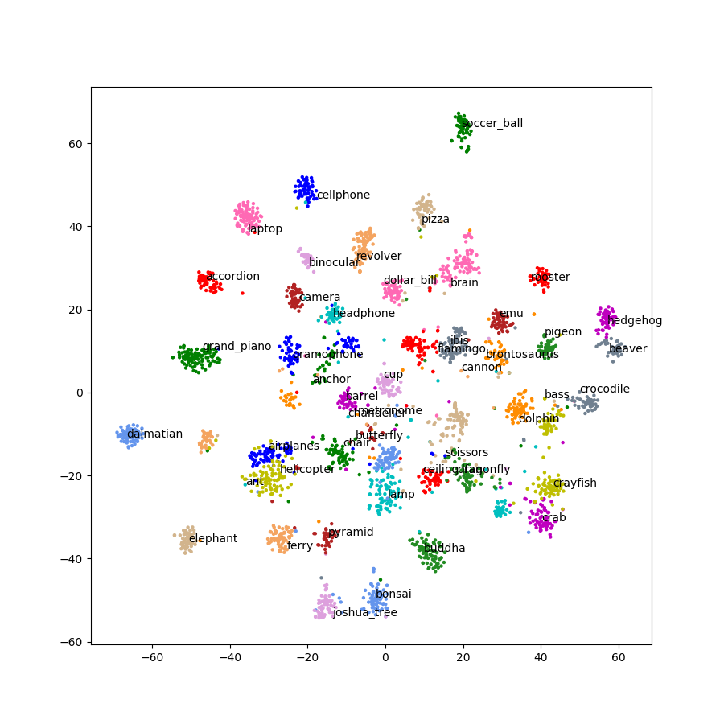
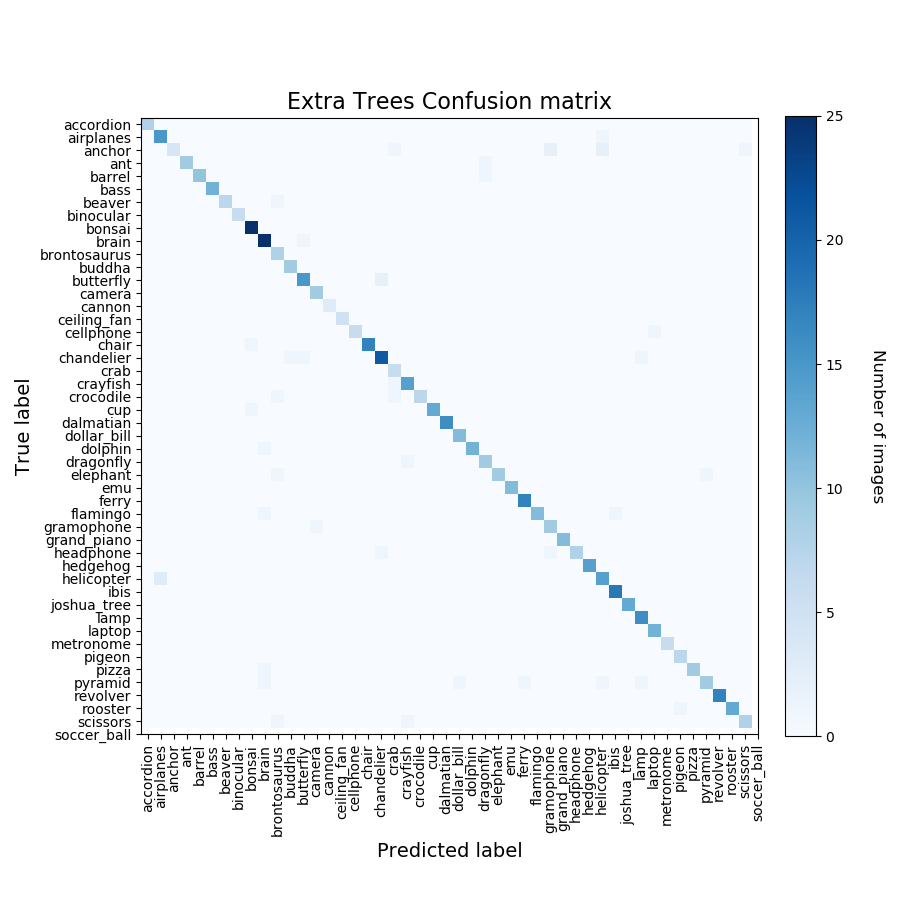
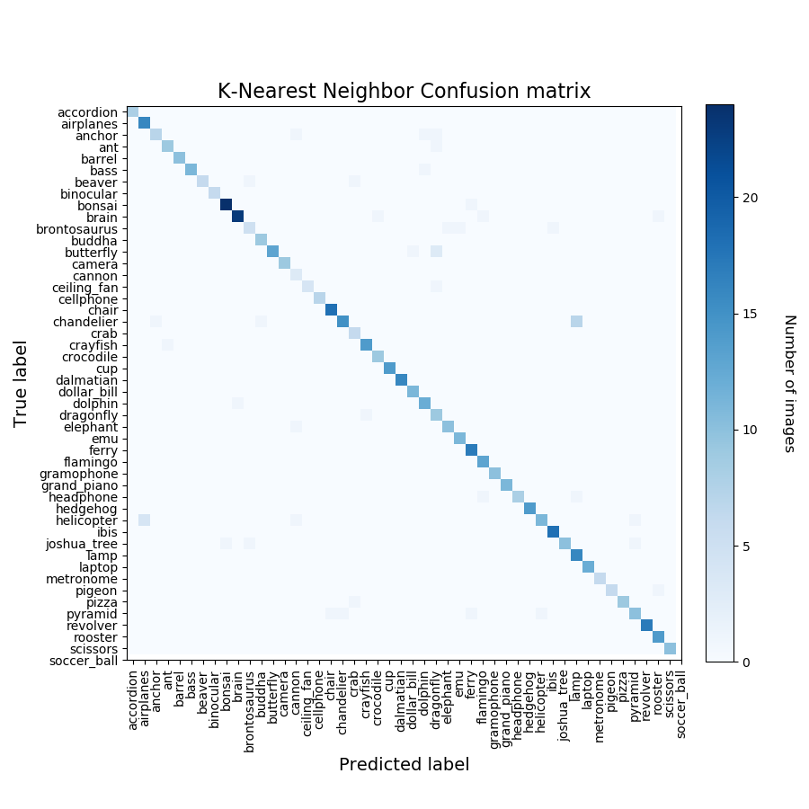

# cnn-svm-classifier

This example uses a sub set of 48 labelled images from the Caltech image
set (http://www.vision.caltech.edu/Image_Datasets/Caltech101/),
limited to between 40 and 80 images per label. The images are fed to a
TensorFlow implementation of Inception V3 with the classification layer
removed in order to produce a set of labelled feature vectors.

Dimensionality reduction is carried out on the 2048-d features using
t-distributed stochastic neighbor embedding (t-SNE) to transform them
into a 2-d feature which is easy to visualize. Note that t-SNE is used
as an informative step. If the same color/label points are mostly
clustered together there is a high chance that we could use the features
to train a classifier with high accuracy.

The 2048-d labelled features are presented to a number of classifiers.
Intially the project was to train a Support Vector Machine to
classify images, however for comparison this has been extended to the
following:

* Support Vector Machine (SVM)
* Extra Tress (ET)
* Random Forest (RF)
* K-Nearest Neighbor (KNN)
* Multi-layer Perceptron (ML)

Training and validation time, and the accuracy of each classifier is
displayed. Most classifier were run with their default tuning values,
however tuning was carried on those classifier that fell well below 90%
accuracy for their defaults, such of Extra Trees and Random Forsest
(initially in the 75 - 78% region).

A summary of the results is as follows (training/test time, accuracy):

* SVM: 6.77 sec, 96.9%
* ET: 1.52 sec, 93.2%
* RF: 16.47 sec, 90.8%
* KNN: 2.2 sec, 91.5%
* MLP: 13.83 sec, 97.1%

Note that these results vary between runs, and are just representative.

## Quick Start

1. Unzip the curated image set caltech_101_images.zip. You should then
have a directory called caltech_101_images in the same directory as
inception3_svm_classifier.py

2. The imagenet directory already has classify_image_graph_def.pb. If I've
removed it to save space on my github account, then download it from
http://download.tensorflow.org/models/image/imagenet/inception-2015-12-05.tgz,
un-zip it, and place classify_image_graph_def.pb in a directory called 'imagenet'.

3. Run inception3_svm_classifier.py using Python 3. The following packages
are required: tensorflow, sklearn (scikit-learn), numpy, matplotlib.
Run time (from scratch) was about 28 minutes on my dual core i7 Skylake
laptop.

## t-SNE

## Support Vector Machine

## Extra Trees

## Random Forest

## K-Nearest Neighbor

## Multi-layer Perceptron

